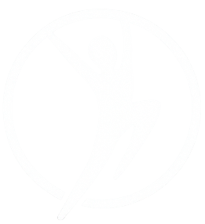
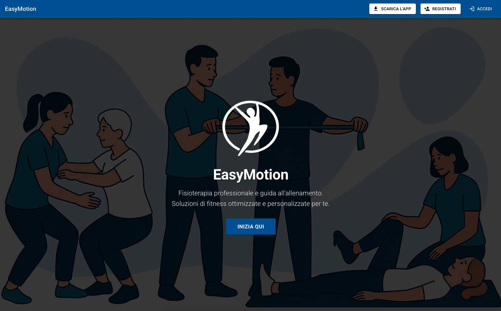
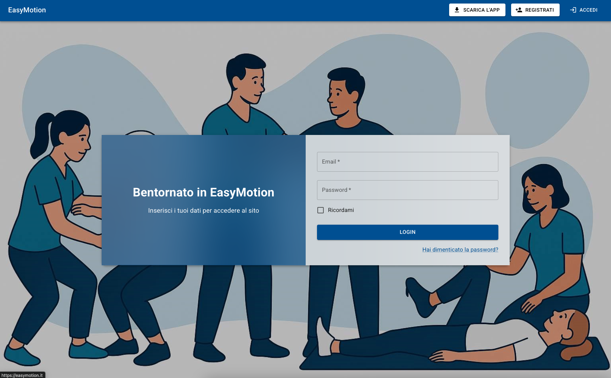
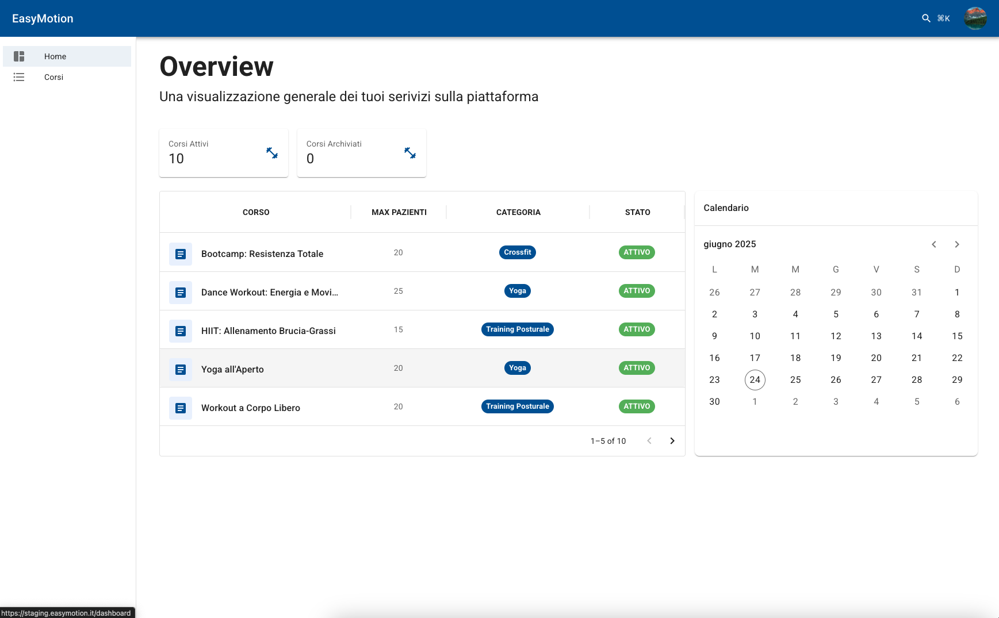
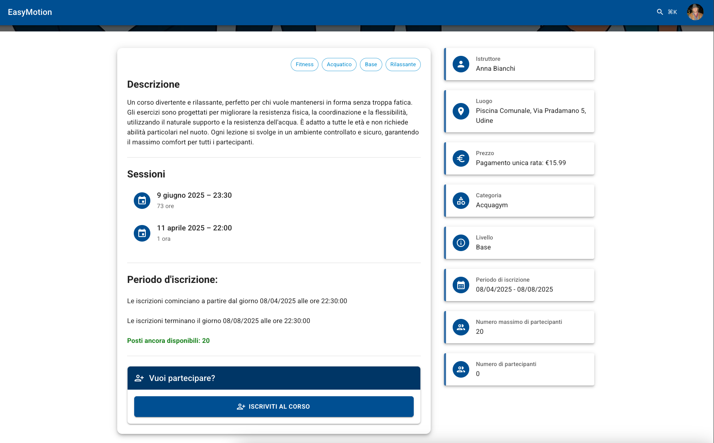
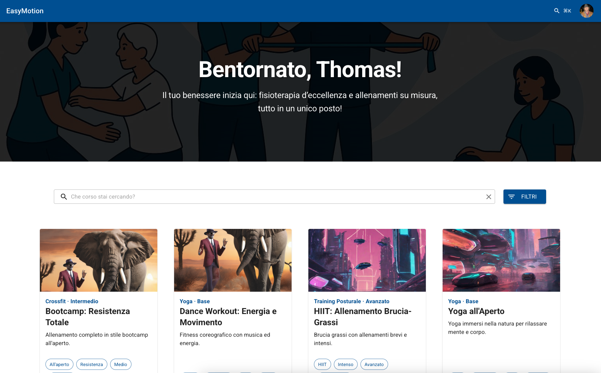
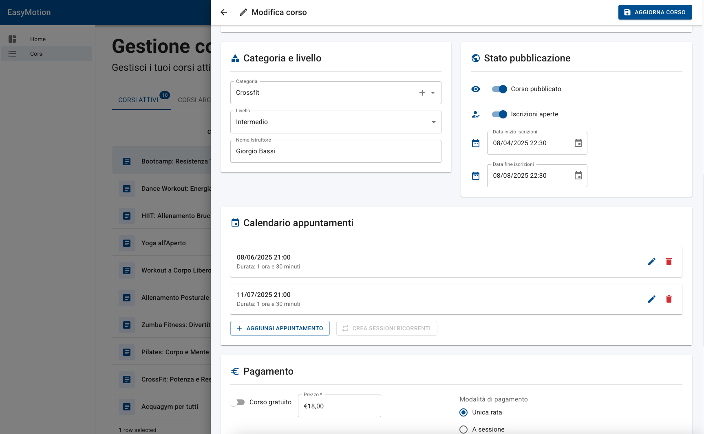

    

<h1 align="center">
    Easymotion
</h1>

<em>Empowering accessible healthcare for movement, physiotherapy, and nutrition—together, for everyone.</em>

---

## What is Easymotion?

Easymotion is an open platform currently in development, dedicated to making healthcare for movement, physiotherapy, and nutrition more accessible and collaborative. This repository aims to deliver a robust, scalable, and user-friendly solution that enables patients, physiotherapists, and healthcare professionals to connect, manage courses, and share resources efficiently.

- **Patients** can find and subscribe to courses, track their progress, and communicate with professionals.
- **Physiotherapists** can create and manage courses, monitor patient progress, and collaborate with other professionals.
- **Developers** can contribute to a modern, modular codebase built with best practices in mind.

---

## 🖼️ Easymotion in Action

Get a glimpse of Easymotion's intuitive interface and collaborative features!

  
  
  
  
  
  

  <a href="./.github/assets/"><strong>→ Take a look at all the screenshots here</strong></a>

---

## Tech Stack

Easymotion is built as a modern monorepo using the following technologies:

- **TypeScript** — Strongly typed language for both backend and frontend code.
- **Node.js** — Backend runtime environment.
- **NestJS** — Web framework for building the RESTful API.
- **React** — Frontend library for building interactive user interfaces.
- **Vite** — Fast frontend build tool and development server.
- **Prisma** — Type-safe ORM for database access and migrations.
- **PostgreSQL** — Relational database for persistent storage.
- **Docker** — Containerization for consistent development and deployment environments.
- **pnpm** — Fast, disk space-efficient package manager with workspace support.
- **Jest** — Testing framework for unit and integration tests.
- **ESLint & Prettier** — Code quality and formatting tools.
- **swagger-typescript-api** - Automatic frontend client generation from OpenAPI JSON Schema

---

## Documentation

Comprehensive documentation is available in the [`docs/`](./docs/) folder. Here are some quick links to get you started as a developer:

1. [Getting started](./docs/getting-started.md)
2. [Development Guidelines](./docs/development-guidelines.md)
3. [Build Instructions](./docs/build.md)
4. [CI/CD Deployment](./docs/cicd-deployment.md)
5. [How to Release](./docs/how-to-release.md)
6. [Going to Production](./docs/going-to-prod.md)
7. [Definition of Done](./docs/definition-of-done.md)
8. [Roadmap](./docs/roadmap.md)

---

> For any questions or contributions, please refer to the documentation above or open an issue in this repository.
